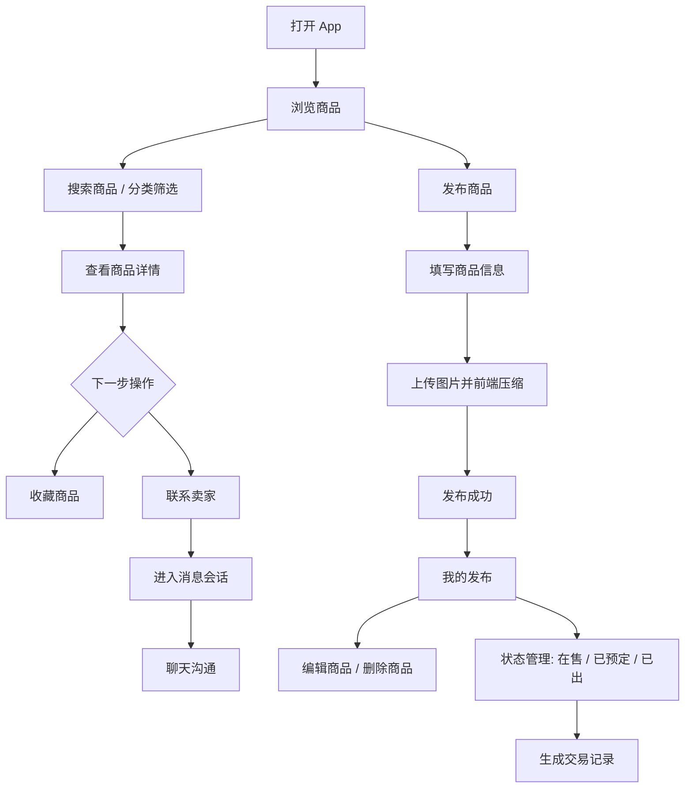
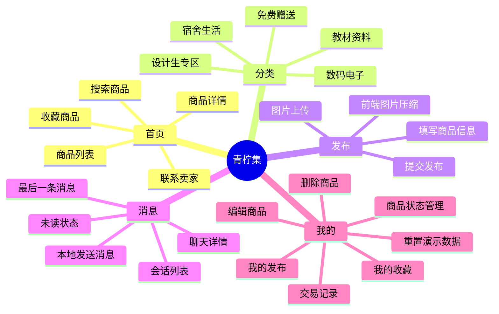
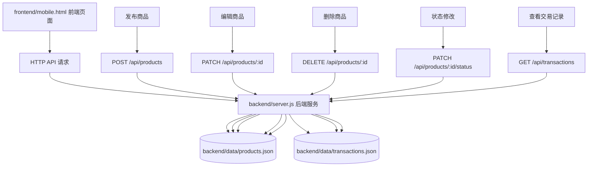

# 青柠集产品流程说明

## 1. 项目一句话定位

青柠集是一个面向校园学生的闲置物品交换 App 本地可运行原型，帮助教材、设计用品、宿舍用品等闲置物品在校内更清楚、更方便地流转。

## 2. 用户使用流程图

## 3. 功能架构图

## 4. 前后端数据流图

### 数据流说明

- 发布商品：前端在发布表单中收集商品名称、价格、分类、地点、卖家和图片数据，通过 `POST /api/products` 提交到后端，后端写入 `products.json`。
- 编辑商品：前端在编辑弹窗中修改商品信息，通过 `PATCH /api/products/:id` 提交，后端更新对应商品并保存到 `products.json`。
- 删除商品：前端触发删除操作后，通过 `DELETE /api/products/:id` 请求后端，后端从 `products.json` 中移除该商品。
- 状态修改：前端在“我的发布”中切换在售、已预定、已出，通过 `PATCH /api/products/:id/status` 修改商品状态；后端同时更新 `products.json`，并把状态变化记录写入 `transactions.json`。
- 交易记录：前端通过 `GET /api/transactions` 获取状态变化记录，用于展示商品从在售到预定或已出的流转过程。

## 5. 核心功能闭环

商品流转闭环：用户可以浏览商品、查看详情、收藏感兴趣的物品，也可以发布自己的闲置物品，并通过编辑、删除和状态管理维护商品信息。

沟通闭环：用户在商品详情中点击联系卖家后，会生成消息会话；进入聊天详情后可以查看模拟对话并本地发送消息，形成从商品兴趣到沟通确认的基础路径。

管理闭环：卖家可以在“我的发布”中管理自己发布的商品，买家可以在“我的收藏”中查看已收藏内容，状态变化会沉淀为交易记录。

演示数据闭环：项目提供重置演示数据能力，可以把商品数据恢复到适合展示的初始状态，方便课程汇报、作品集录屏和反复演示。

## 6. 当前原型边界

青柠集当前是本地可运行原型，不是已经上线的 App。它主要用于验证产品流程、页面结构和核心交互。

当前没有接入真实登录系统，没有真实数据库，没有云端图片文件存储，也没有真实即时通信。商品数据由本地 JSON 文件模拟，收藏和消息会话主要保存在浏览器本地。

## 7. 后续扩展方向

- 真实登录：增加注册、登录、用户身份和个人资料。
- 云端数据库：用数据库替代本地 JSON 文件，支持多用户数据管理。
- 图片文件存储：将商品图片上传到服务器或云存储，减少前端本地数据压力。
- 真实聊天：接入后端消息存储或实时通信能力。
- 校园认证：增加学校邮箱、学号或校园身份验证，提升交易可信度。
- 交易完成评价：在交易完成后增加评价和信用记录，帮助后续用户判断卖家与买家可靠性。
